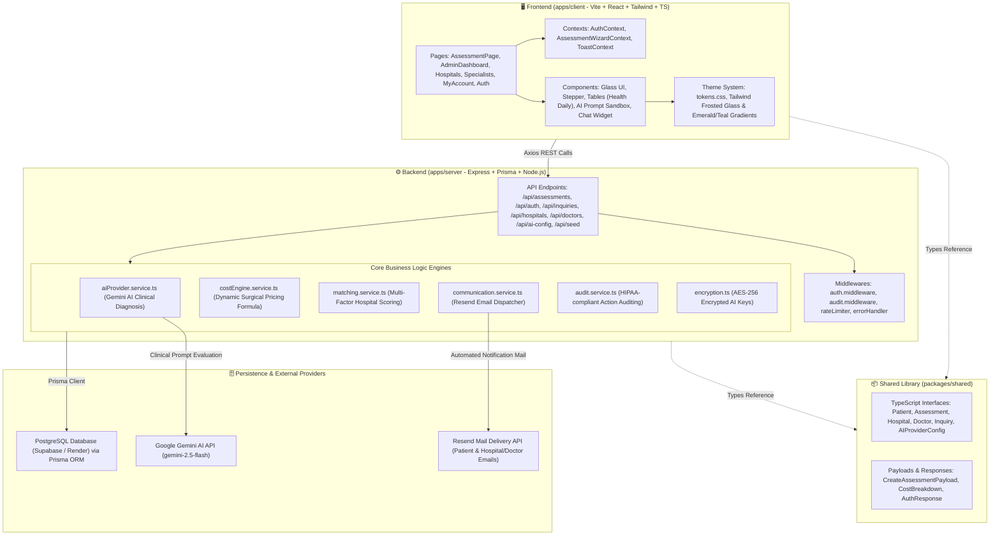
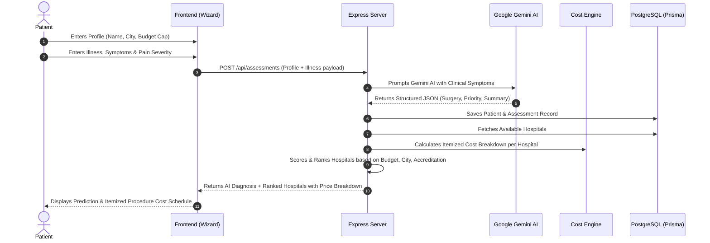
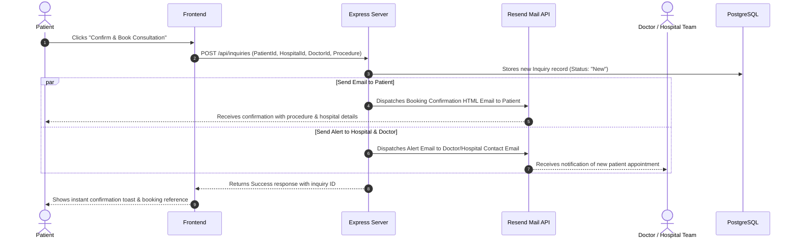

# 🧠 MediMatch — Master Mindmap & Logic Architecture Guide

Welcome to the **MediMatch System Mindmap**. This document details the entire architectural blueprint, file-by-file logic placement, data flows, and algorithms across the client, server, shared libraries, and database.

---

## 🗺️ 1. High-Level Architecture Mindmap (Mermaid)

---

## 🧭 2. "Kaai Jagya E Shu Logic Che" (File-by-File Logic Mapping)

### 🏥 A. Frontend Architecture (`apps/client/src`)

| File / Directory | Shu Logic Che (Functionality & Business Logic) | Key Functions & Components |
| :--- | :--- | :--- |
| [`App.tsx`](file:///e:/MediMatch/apps/client/src/App.tsx) | Root application router, route guards, dark frosted glass layout wrappers, background ambient orbs, and global Floating Health Assistant Widget. | `<App />`, `<RouteGuards />`, `<HealthAssistantWidget />` |
| [`context/AuthContext.tsx`](file:///e:/MediMatch/apps/client/src/context/AuthContext.tsx) | Manages authentication session for both Patients & Admins. Handles JWT storage in `localStorage`, user role decoding, and persistent login state across page reloads. | `login()`, `logout()`, `register()`, `useAuth()` |
| [`context/AssessmentWizardContext.tsx`](file:///e:/MediMatch/apps/client/src/context/AssessmentWizardContext.tsx) | Multi-step assessment wizard state manager. Stores patient profile, illness description, severity ratings, AI diagnostic response, and matched hospitals. | `formData`, `setFormData`, `step`, `nextStep`, `prevStep` |
| [`components/assessment/StepProfile.tsx`](file:///e:/MediMatch/apps/client/src/components/assessment/StepProfile.tsx) | Step 1 of Assessment: Collects full name, phone number, age, gender, city, and patient's surgical budget cap. | Form validation, budget slider input. |
| [`components/assessment/StepIllness.tsx`](file:///e:/MediMatch/apps/client/src/components/assessment/StepIllness.tsx) | Step 2 of Assessment: Captures primary symptoms, duration, pain severity scale (1-10), pre-existing conditions, and medical history. Features **Strict Clinical Relevance & Anti-Gibberish Shield** (`validateClinicalInput`): blocks placeholders ("NA", "none"), keyboard mashing patterns ("qwertyuiop", "asdfgh"), unreadable consonant clusters, and demands real anatomical terms (knee, chest, back, stomach) or clinical symptoms (pain, fever, swelling). | `validateClinicalInput()`, real-time validation indicator, symptom pill selection. |
| [`components/assessment/StepDiagnosis.tsx`](file:///e:/MediMatch/apps/client/src/components/assessment/StepDiagnosis.tsx) | Step 3 of Assessment: Displays AI-predicted surgery indication, urgency priority badge, recommended hospitals ranked by score, and **Itemized Surgical Cost Schedule Table** inside booking modal. Features **Insufficient Clinical Information Alert Banner** with quick-action button to return to Step 2 if symptoms were too vague or placeholder. | `handleBookAppointment()`, `isInsufficientInfo` banner, cost breakdown modal. |
| [`components/admin/SubmissionsTable.tsx`](file:///e:/MediMatch/apps/client/src/components/admin/SubmissionsTable.tsx) | Admin table displaying all patient submissions with **Health Daily KPI Ribbon** (Reports Today/Week/Month, Urgent/Routine Triage, Active Status), circular patient avatar thumbnails, hairline borders, and dossier modal. | `fetchAssessments()`, `selectedAssessment`, KPI calculations. |
| [`components/admin/InquiriesTable.tsx`](file:///e:/MediMatch/apps/client/src/components/admin/InquiriesTable.tsx) | Admin table tracking booked hospital/doctor inquiries with **Health Daily KPI Ribbon** (Calls Made, Status New/Contacted/Closed), circular avatar indicators, and status updates. | `fetchInquiries()`, `handleStatusChange()`. |
| [`components/admin/HospitalsManager.tsx`](file:///e:/MediMatch/apps/client/src/components/admin/HospitalsManager.tsx) | Admin CRUD interface for hospital network. Features Health Daily KPI ribbon (Tier NABH/JCI, Capacity Beds/ICU), photo thumbnails, bed counters, and email configuration. | `fetchHospitals()`, `openAddModal()`, `handleDelete()`. |
| [`components/admin/DoctorsManager.tsx`](file:///e:/MediMatch/apps/client/src/components/admin/DoctorsManager.tsx) | Admin CRUD interface for specialist surgical faculty with Health Daily KPI ribbon (Surgical/Clinical, Experience >15yr/>10yr), circular doctor photos, and fee indicators. | `fetchDoctors()`, `openEditModal()`, `handleDelete()`. |
| [`components/admin/AIModelForm.tsx`](file:///e:/MediMatch/apps/client/src/components/admin/AIModelForm.tsx) | Admin AI configuration panel: Live provider selection (Gemini / OpenAI / Custom), AES-256 encrypted API key entry, model selection (`gemini-2.5-flash`), and clinical system prompt tweaking. | `handleSave()`, API key masking. |
| [`components/admin/PromptSandbox.tsx`](file:///e:/MediMatch/apps/client/src/components/admin/PromptSandbox.tsx) | Interactive testing sandbox for clinical prompts: Allows admins to test patient symptom strings against Gemini AI in real-time and inspect JSON parsing output. | `handleRunTest()`, response timing metrics. |
| [`components/admin/DatabaseSeeder.tsx`](file:///e:/MediMatch/apps/client/src/components/admin/DatabaseSeeder.tsx) | Database seeder trigger component in Admin panel with live item counts and reset options. | `handleSeed()`, stats refresh. |
| [`components/ui/Tabs.tsx`](file:///e:/MediMatch/apps/client/src/components/ui/Tabs.tsx) | Floating pill navigation dock matching Health Daily aesthetic (solid mint/teal active pill, dark badge counters, frosted backdrop). | `<Tabs />`, active state animation. |
| [`styles/tokens.css`](file:///e:/MediMatch/apps/client/src/styles/tokens.css) & [`tailwind.config.ts`](file:///e:/MediMatch/apps/client/tailwind.config.ts) | Core design system tokens: Deep space obsidian glass backgrounds (`#0b1d2d`, `#07162d`), teal/emerald accents, border translucency (`border-white/10` to `border-white/20`), backdrop blurs (`backdrop-blur-2xl`). | Glass card utility classes, glow shadows. |

---

### ⚙️ B. Backend Architecture (`apps/server/src`)

| File / Directory | Shu Logic Che (Functionality & Business Logic) | Key Algorithms & Logic |
| :--- | :--- | :--- |
| [`server.ts`](file:///e:/MediMatch/apps/server/src/server.ts) & [`app.ts`](file:///e:/MediMatch/apps/server/src/app.ts) | Express server bootstrapping, CORS configuration, JSON body parsing, security headers, rate limiting, and master route mounting (`/api/*`). | Trust proxy handling for cloud deployment (Render/Supabase). |
| [`services/aiProvider.service.ts`](file:///e:/MediMatch/apps/server/src/services/aiProvider.service.ts) | **Clinical AI Prediction Logic**: Connects to Google Gemini API using dynamic database-stored encrypted API keys (with fallback to `GEMINI_API_KEY`). Sends patient symptoms, history, and severity to prompt Gemini, then parses structured JSON (predicted procedure, urgency level, summary). | `predictSurgery()`, markdown JSON extractor, fail-safe rule-based fallback. |
| [`services/costEngine.service.ts`](file:///e:/MediMatch/apps/server/src/services/costEngine.service.ts) | **Dynamic Surgical Pricing Formula**: Calculates itemized cost schedule for any procedure and hospital: `Surgeon Fee = Base * Multiplier`, `OT Charges`, `Room Accommodation = Rate * Stay Duration`, `Medicines & Consumables`, `Total Package Price = Sum`, `Savings = BudgetCap - Total`. | `calculateCostBreakdown()`, `PRICING_CONFIG`. |
| [`services/matching.service.ts`](file:///e:/MediMatch/apps/server/src/services/matching.service.ts) | **Hospital Matching & Ranking Algorithm**: Scores all network hospitals against the patient's criteria. Weights include: City proximity match (+30 pts), Budget fit (+25 pts), NABH/JCI accreditation (+20 pts), ICU bed availability (+15 pts), and AI procedure fit. | `rankHospitalsForPatient()`, multi-factor scoring algorithm. |
| [`services/communication.service.ts`](file:///e:/MediMatch/apps/server/src/services/communication.service.ts) | **Automated Dual Email Dispatch**: Sends confirmation emails via Resend API when a patient books an appointment: 1. Booking confirmation to the Patient. 2. Notification alert with patient details to the Hospital and assigned Doctor. | `sendBookingConfirmationToPatient()`, `sendInquiryAlertToHospital()`. |
| [`routes/assessments.routes.ts`](file:///e:/MediMatch/apps/server/src/routes/assessments.routes.ts) | Handles assessment submission: saves patient profile, runs AI prediction, computes cost breakdowns across all hospitals, stores assessment in DB, and returns recommendations. | `POST /api/assessments`, `GET /api/assessments`. |
| [`routes/inquiries.routes.ts`](file:///e:/MediMatch/apps/server/src/routes/inquiries.routes.ts) | Handles appointment bookings: Creates inquiry record, triggers dual email dispatch via `communication.service.ts`, and allows admin status updates. | `POST /api/inquiries`, `GET /api/inquiries`, `PATCH /api/inquiries/:id/status`. |
| [`routes/auth.routes.ts`](file:///e:/MediMatch/apps/server/src/routes/auth.routes.ts) | User authentication for Patients and Admins: Registration with password hashing (bcrypt), login validation, JWT generation with expiration. | `POST /api/auth/register`, `POST /api/auth/login`, `POST /api/auth/admin/login`. |
| [`routes/aiConfig.routes.ts`](file:///e:/MediMatch/apps/server/src/routes/aiConfig.routes.ts) | Admin AI configuration: Stores encrypted API key via AES-256, updates model name and prompt template, provides masked key previews. | `GET /api/ai-config`, `PUT /api/ai-config`. |
| [`routes/seed.routes.ts`](file:///e:/MediMatch/apps/server/src/routes/seed.routes.ts) & [`data/seedData.ts`](file:///e:/MediMatch/apps/server/src/data/seedData.ts) | Database seeding logic: Populates initial Apollo, Fortis, Max, AIIMS hospitals, specialist surgeons, and default admin user credentials. | `POST /api/seed`, `GET /api/seed/stats`. |
| [`lib/encryption.ts`](file:///e:/MediMatch/apps/server/src/lib/encryption.ts) | Cryptographic utility using Node.js `crypto` with AES-256-CBC and random IVs to securely encrypt sensitive third-party API keys before saving in PostgreSQL. | `encrypt()`, `decrypt()`. |
| [`prisma/schema.prisma`](file:///e:/MediMatch/apps/server/prisma/schema.prisma) | Master PostgreSQL schema defining tables: `Patient`, `Assessment`, `Hospital`, `Doctor`, `Inquiry`, `AIProviderConfig`, `AdminUser`, and `AuditLog`. | Database relations, indexing, and foreign keys. |

---

## 🔄 3. End-to-End User Journeys (Logic Flows)

### Flow 1: Patient Assessment & AI Surgical Match

### Flow 2: Appointment Booking & Dual Email Notification

